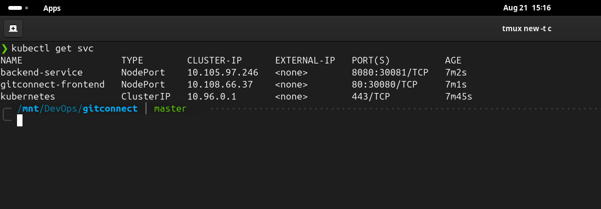
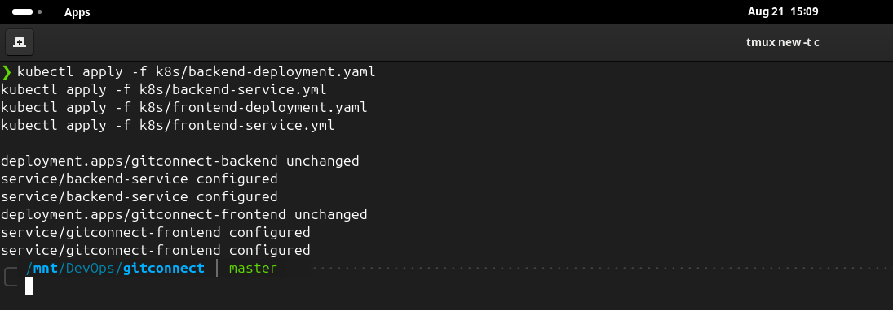
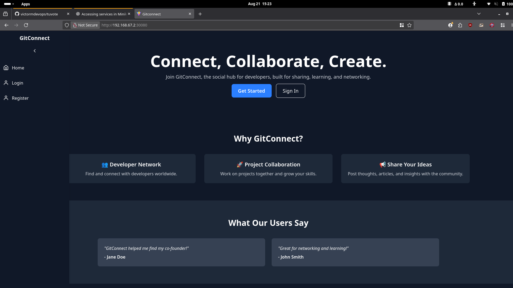
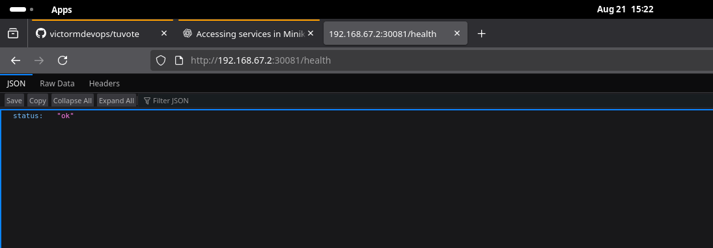
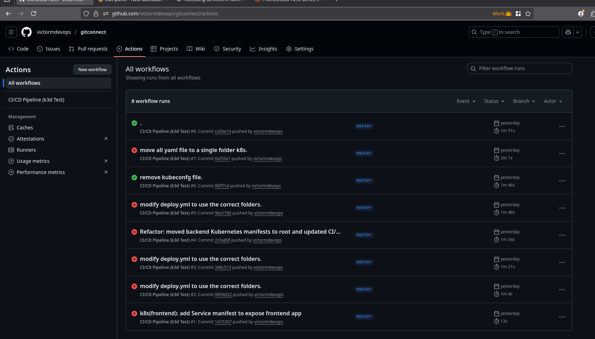
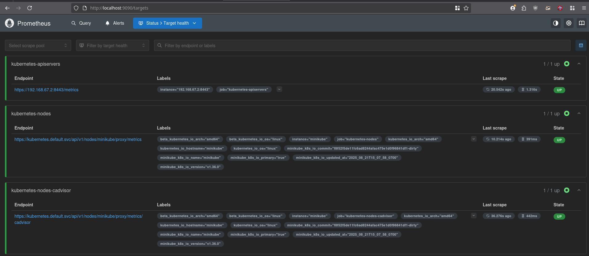
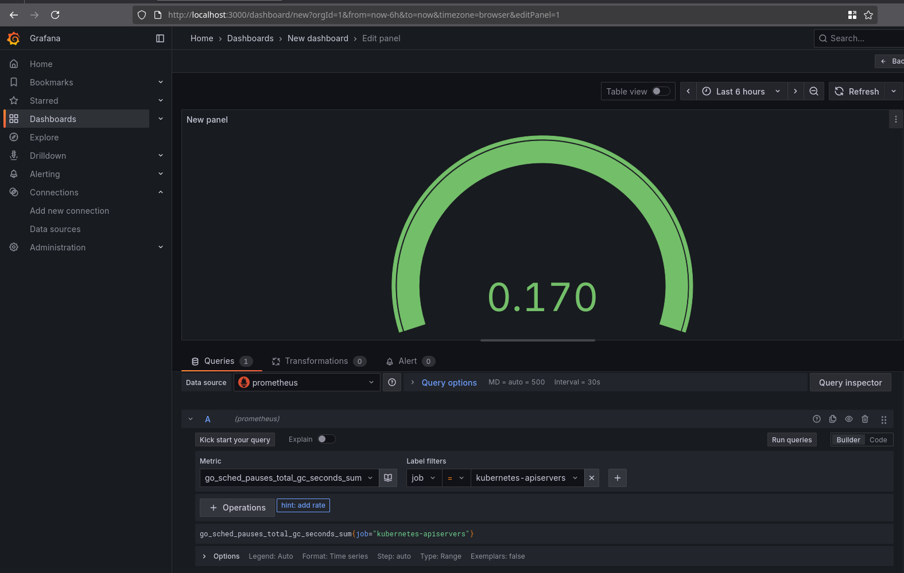

# GitConnect – DevOps CI/CD Project

## 📌 Project Overview

This project demonstrates a full DevOps workflow by containerizing and deploying a MERN-based GitConnect application.  
It covers CI/CD pipelines, Kubernetes deployment, and monitoring using Prometheus & Grafana.

## ⚡ Tech Stack

- Frontend: React
- Backend: Node.js / Express
- Database: MongoDB
- Containerization: Docker, Docker Compose
- Orchestration: Kubernetes (Minikube / k3d)
- CI/CD: GitHub Actions
- Monitoring: Prometheus & Grafana

## 🚀 Features

- CI/CD pipeline with automated build & deployment
- Kubernetes manifests for backend, frontend, services, and secrets
- Monitoring stack (Prometheus + Grafana)
- Scalable deployment with NodePort services

## 📊 Monitoring

- Prometheus: Collects metrics
- Grafana: Visualizes metrics & dashboards

## 📐 Architecture Diagram

GitHub Actions (CI/CD)
|
DockerHub Registry
|
------------------
| |
Frontend (React) Backend (Node)
| |
----- Kubernetes -----
|  
 Prometheus + Grafana

## Deployment Proof (Local Minikube)

### Kubectl Pods

### Kubectl Services

### Kubectl logs

### Frontend

### Backend

### GitHub Actions Build

### Prometheus

### Grafana

---

## Security and Secrets Management

- No hard-coded credentials in code or manifests
- Sensitive values are managed via **`secret.yaml`**
- Non-sensitive configurations are managed via **`configmap.yaml`**
- Kubernetes Secrets and ConfigMaps are mounted into pods at runtime
- Docker images are built following the least-privilege principle

---

## Why This Project Matters for DevOps

This project demonstrates:

- Multi-service containerization with **Docker** and **Docker Compose**
- **Infrastructure as Code** with Kubernetes manifests
- Automated **CI/CD** with GitHub Actions
- Secure secret and config management using Kubernetes **Secret** and **ConfigMap**
- Health checking and automatic log collection
- **Monitoring with Prometheus** (metrics collection) and **Grafana** (dashboards & visualization)
- Deployment-ready stack that can be extended with full observability

---

## Author

Victor Muthomi
